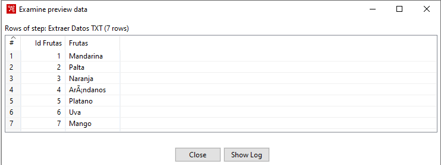
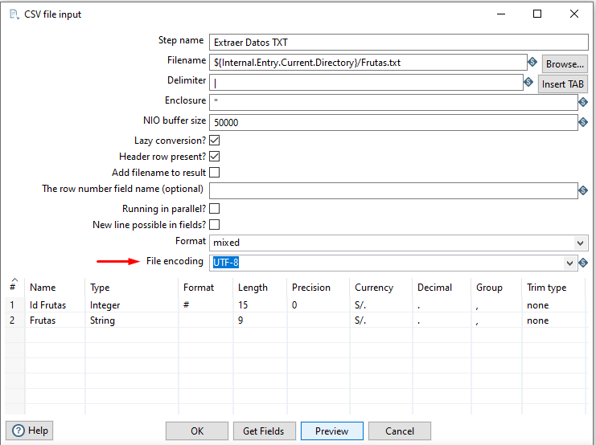

# Spoon
Notas Generales


## Problemas con Informacion con Tildes

Se puede notar el la fila numero 4 contiene una palabra con tilde.


Esto se soluciona seleccionando el ```File encoding``` con el formato  ```UTF-8```



